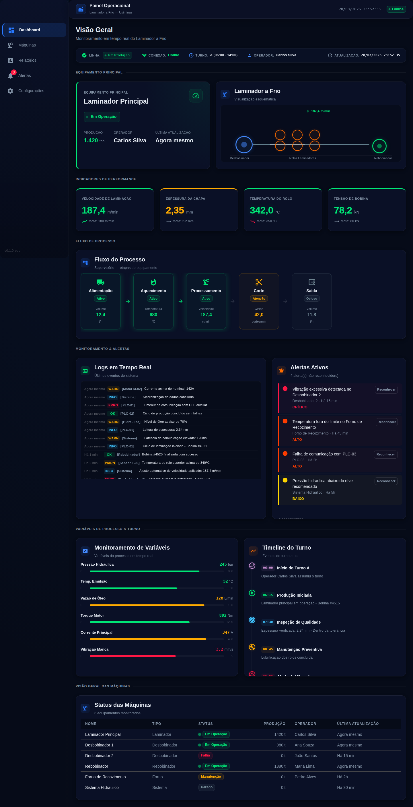
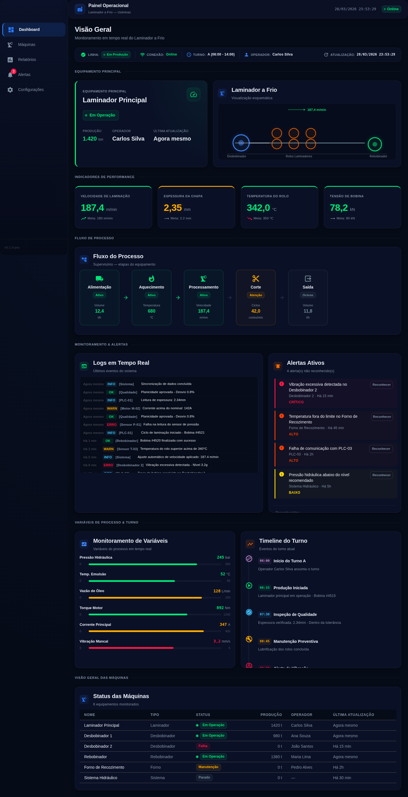
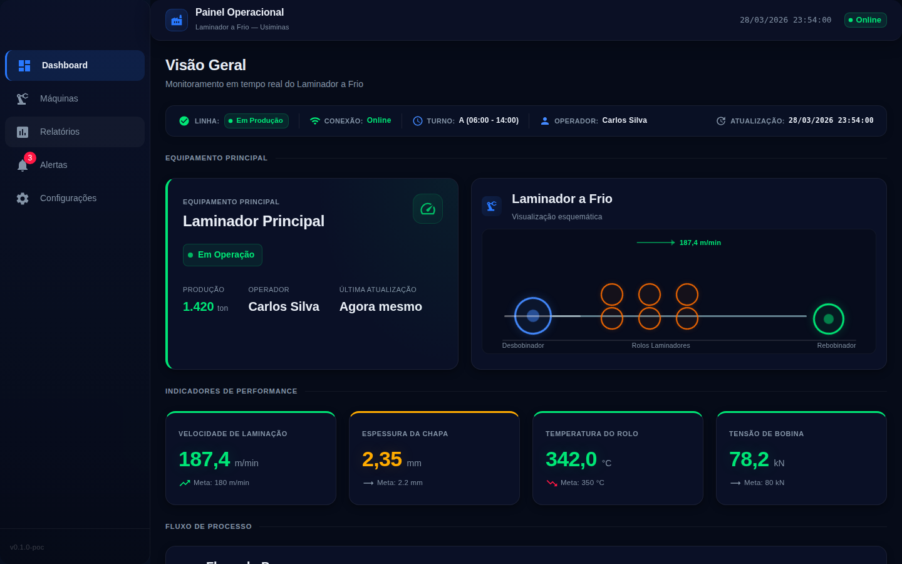
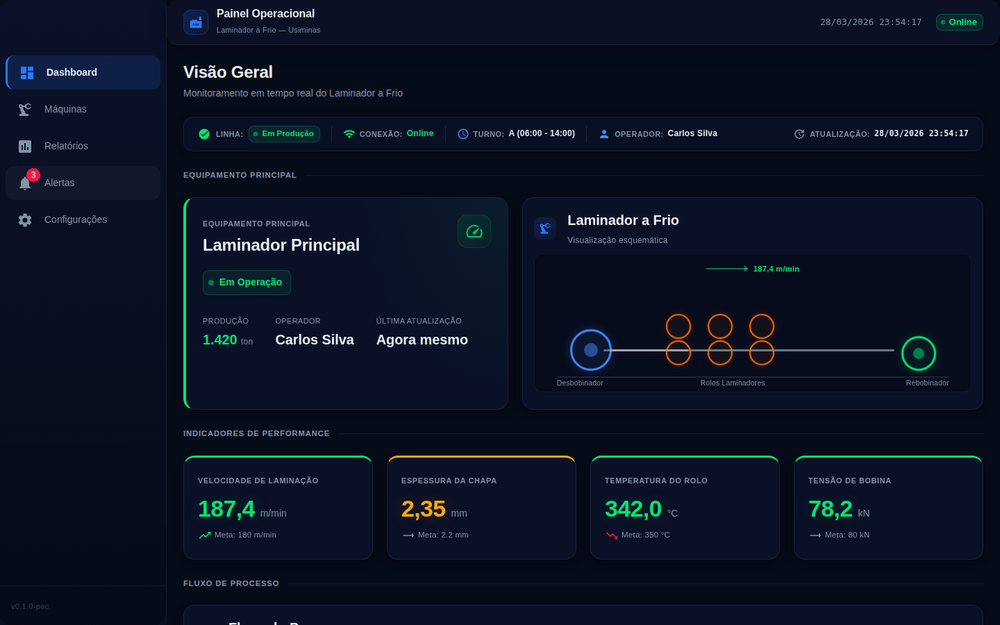
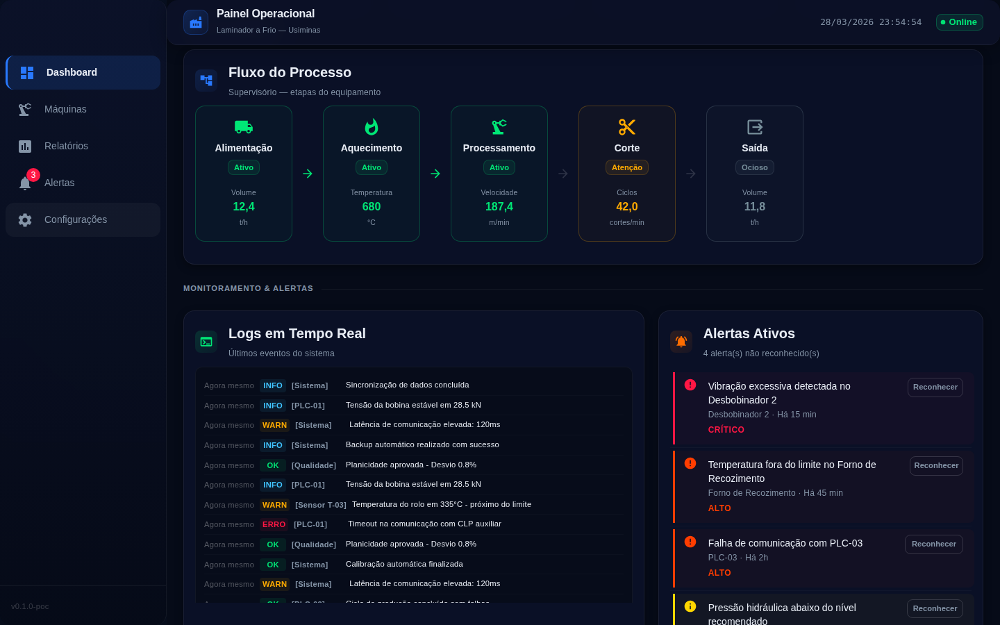
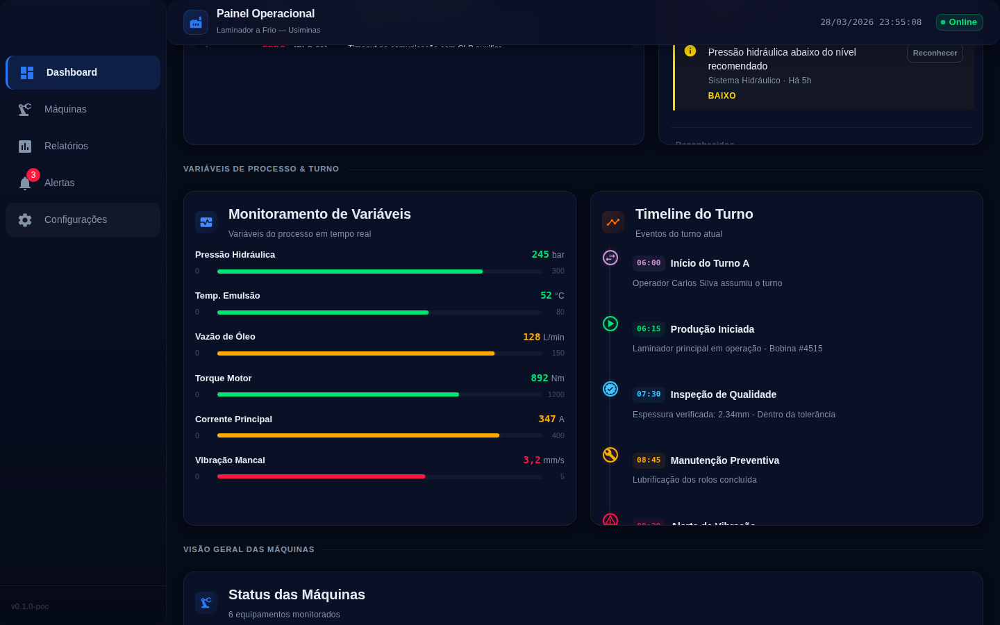
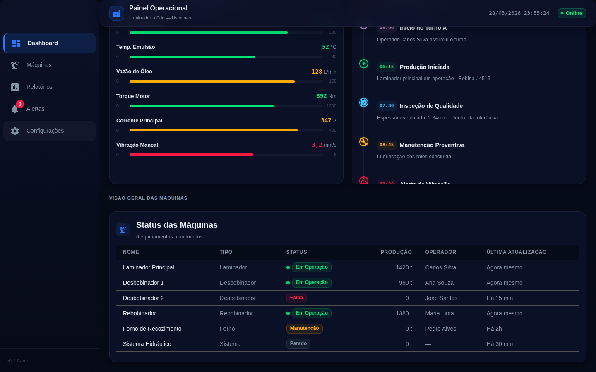

# Screenshots — Painel Operacional Usiminas

Capturas de tela de todas as telas, menus e submenus da aplicação **Painel Operacional – Laminador a Frio | Usiminas**.

---

## Tela Principal — Dashboard (Visão Geral)

> Tela inicial com header, sidebar e seção "Equipamento Principal".

---

## Dashboard Completo (Página Inteira)

> Página inteira do dashboard com todas as seções visíveis.

---

## Menu — Sidebar

### Dashboard (ativo / selecionado)

Conforme screenshots `01` e `02` acima — item **Dashboard** está ativo (destaque azul com borda esquerda).

### Menu: Máquinas (hover)

### Menu: Relatórios (hover)

### Menu: Alertas (hover) — Badge com 3 notificações

### Menu: Configurações (hover)

---

## Seções do Dashboard

### Indicadores de Performance (KPIs) + Fluxo de Processo

> KPIs: Velocidade de Laminação, Espessura da Chapa, Temperatura do Rolo, Tensão de Bobina.  
> Fluxo de Processo com etapas sequenciais.

### Monitoramento & Alertas (Logs + Alertas Ativos)

> Logs em Tempo Real com eventos do sistema e Alertas Ativos com ações de reconhecimento.

### Variáveis de Processo & Turno (Timeline)

> Monitoramento de Variáveis (barras de progresso) e Timeline do Turno com eventos do turno atual.

### Visão Geral das Máquinas (Tabela)

> Tabela com status, produção, operador e última atualização de todos os equipamentos monitorados.

---

## Resumo dos Itens Capturados

| # | Arquivo | Descrição |
|---|---------|-----------|
| 01 | `01-dashboard-visao-geral.png` | Viewport inicial — Dashboard com header e sidebar |
| 02 | `02-dashboard-full-page.png` | Página inteira do Dashboard |
| 03 | `03-menu-maquinas-hover.png` | Sidebar — Menu "Máquinas" (hover) |
| 04 | `04-menu-relatorios-hover.png` | Sidebar — Menu "Relatórios" (hover) |
| 05 | `05-menu-alertas-hover-badge3.png` | Sidebar — Menu "Alertas" (hover, badge 3) |
| 06 | `06-menu-configuracoes-hover.png` | Sidebar — Menu "Configurações" (hover) |
| 07 | `07-dashboard-kpis-fluxo-processo.png` | Seção KPIs + Fluxo de Processo |
| 08 | `08-dashboard-monitoramento-alertas.png` | Seção Monitoramento & Alertas |
| 09 | `09-dashboard-variaveis-turno.png` | Seção Variáveis de Processo & Timeline do Turno |
| 10 | `10-dashboard-maquinas-overview.png` | Seção Visão Geral das Máquinas (Tabela) |
